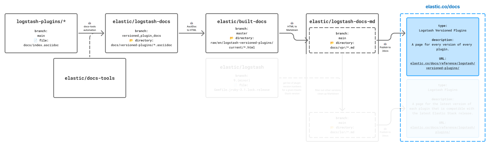
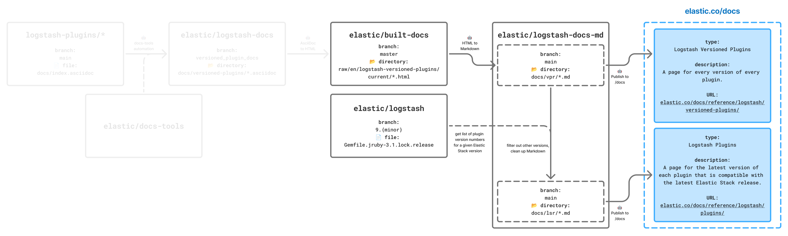

# Logstash plugin docs

Documentation for [Logstash plugins (LSR)](https://www.elastic.co/docs/reference/logstash/plugins) and [Logstash Versioned Plugin Reference (VPR)](https://www.elastic.co/docs/reference/logstash/versioned-plugins), where VPR includes a page for every versions of every plugin and LSR includes just one page per plugin &mdash; the latest plugin version that was released with the current Elastic Stack version.

>[!IMPORTANT]
>This repo contains generated Markdown files. The files in the `docs/` directory should _never_ be manually edited because any changes will be overwritten with the next update.

## Update schedule

The LSR and VPR are updated on different schedules:

* LSR pages are updated once per release.
* We check for VPR updates every 8 hours.

## Update docs

### In the GitHub UI

**LSR**

_TO DO: Can't be added until this PR is merged into `main`._

**VPR**

_TO DO: Can't be added until this PR is merged into `main`._

### Locally

**Prerequisites**

To use the scripts in this repo, you will need [npm](https://www.npmjs.com/) and [Node](https://nodejs.org/en). We _highly_ recommend installing both via [NVM](https://github.com/nvm-sh/nvm#installing-and-updating) to ensure you're using the correct Node and npm versions.

Install dependencies using:

```sh
nvm use && npm ci
```

To get all the resources needed to build the Markdown docs ([more details below](#source-files)), run:

```sh
scripts/get-resources.sh <stack version>
```

>[!NOTE]
>The first time you run this script:
>* You will likely need to give permission to execute using `chmod -x scripts/get-resources.sh`.
>* It may take a few minutes to complete because you need to get files from the elastic/built-docs repo. After you run it once, it will just update any files that have changed so it will be faster.

**LSR**

To run an LSR update for a new Elastic Stack release:

```sh
npm run build-docs -- lsr <stack version>
```

**VPR**

To run a VPR-only update:

```sh
npm run build-docs -- vpr
```

## Manual content

Files in the `src/manual-content` directory are manually maintained. These are the only Markdown files that should be edited manually in this repo.

These files include:

* The `index.md` files for both LSR and VPR.
* The Plugin value types (`value-types.md`) page that was added to LSR in 9.0.
* The Core plugin docs that used to live in [the elastic/logstash repo](https://github.com/elastic/logstash/tree/8.18/docs/static/core-plugins).
* The docs for plugins that are created and maintained by a partner.

These files get copied to the `docs/` directory programmatically.

## How the transformation works

This walks through how the process works behind the scenes.

### Source files

We need several source files to generate the appropriate Markdown files. The logic for this step lives in [`scripts/get-resources.sh`](scripts/get-resources.sh). Here are the files the tooling gets:

* HTML files from the elastic/built-docs repo's `raw/en/logstash/current` and `raw/en/logstash-versioned-plugins/current` directories.
* The overview pages for each plugin type from the elastic/logstash-docs repo.
* The Gemfile from the elastic/logstash repo's branch for the specified Elastic Stack version.

These files are stored in a Git-ignored `temp` directory.

### VPR update

The process for updating the VPR docs spans several different repos:

1. **logstash-plugins/\***: Initial changes to plugin docs happen in an individual repo belonging to the [logstash-plugins](https://github.com/logstash-plugins) GitHub org:
    1. A developer makes changes to the source content in the repo where the plugin code lives.
    1. A new version of the plugin is published to rubygems.org, and the new version tag is pushed to the plugin repo.
1. When a docgen job is triggered (manually or automatically), the automation in the [elastic/docs-tools](https://github.com/elastic/docs-tools) repo picks up the new version and:
    1. Identifies changes and opens a PR in the [elastic/logstash-docs](https://github.com/elastic/logstash-docs) repo.
1. **elastic/logstash-docs**: The team reviews and merges the PR in the [elastic/logstash-docs](https://github.com/elastic/logstash-docs).
1. **elastic/built-docs**: On merge, the updated docs are published to the AsciiDoc site. This means that an HTML file for each versioned plugin page is pushed to the [elastic/built-docs](https://github.com/elastic/built-docs) repo, which we'll use the update the Markdown files in this repo.
1. **elastic/logstash-docs-md**: The automation in this repo ([elastic/logstash-docs-md](https://github.com/elastic/logstash-docs-md)) picks up the change and:
    1. Triggers a docs update that translates the HTML to docs-builder compatible Markdown ([more details below](#html-to-markdown-processing)).
    1. Opens a PR in this repo to update the docs.
    1. The Logstash docs team reviews and merges the PR.



### LSR update

When you update the LSR docs, you will update the VPR docs, too. The process for updating the LSR uses a similar process with additional steps after the VPR files are generated:

1. **elastic/logstash-docs-md**: When an Elastic Stack version is released, the Logstash docs team manually triggers an LSR update in this repo ([elastic/logstash-docs-md](https://github.com/elastic/logstash-docs-md)) using GitHub actions.
    1. Specify that we're building `lsr` docs.
    1. Specify the Elastic Stack version.
1. The GitHub action gets this content:
    1. **elastic/built-docs**: The latest versioned HTML files from the elastic/built-docs repo's versioned-plugin-reference directory.
    1. **elastic/logstash**: The latest `Gemfile` lock file from the specified Elastic Stack version branch from the [elastic/logstash](https://github.com/elastic/logstash) repo.
1. **elastic/logstash-docs-md**: Then back in elastic/logstash-docs-md it starts building out the Markdown:
    1. It translates the versioned-plugin-reference HTML files to docs-builder compatible Markdown.
    1. It uses the `Gemfile` lock file to generate a list of all plugins and the plugin version that is aligned with the specified Elastic Stack version ([more details below](#plugin-version-to elastic-stack-version-mapping)).
    1. For each plugin, find the versioned plugin Markdown file that is aligned with the specified Elastic Stack version, copy it to the `docs/lsr` directory, and make some minor changes ([more details below](#vpr-to-lsr-processing)).
    1. For each plugin type, build the overview page listing all plugins with a description.
    1. The Logstash docs team reviews and merges the PR.




### HTML-to-Markdown processing

The HTML-to-Markdown process starts in [`src/generate-vpr-files/index.js`](src/generate-vpr-files/index.js) where we get a list of all the HTML files in the [elastic/built-docs](https://github.com/elastic/built-docs) repo's [`raw/en/logstash-versioned-plugins/current`](https://github.com/elastic/built-docs/blob/master/raw/en/logstash-versioned-plugins/current) directory. We read the contents of each HTML file and use [rehype](https://github.com/rehypejs/rehype) to parse the HTML into an abstract syntax tree (AST), specifically [hast](https://github.com/syntax-tree/hast?tab=readme-ov-file). From there we use a custom rehype plugin to walk the tree, transform nodes (elements and text) based on a set of conditions, and finally transform the AST into Markdown.

The custom rehype plugin that transforms HTML to docs-builder compatible Markdown lives in [`src/generate-vpr-files/clean-html.js`](src/generate-vpr-files/clean-html.js).

The transformation will:

#### Identify the main content

First we get the HTML element that contains the main docs content (a `div` with `id` set to `content`) and filter out the `Edit this page on GitHub` links next to each heading and the notice stating there is a newer version of the docs.

#### Update headings

_Context: In AsciiDoc, the first heading on a page might not be an `h1` and subsequent headings might not be incremental. In docs-builder, we _require_ every page has an `h1`._

We find all headings and:

* Ensure the first heading on each page is an `h1`.
* Ensure all other headings are incremental.
* Add an ID to each heading using docs-builder syntax.

#### Replace links

_Context: In the HTML generated by the AsciiDoc build, relative links are used to link to other elastic.co pages. In docs-builder, there are [several types of links](https://elastic.github.io/docs-builder/syntax/links/)._

We find all links and update the value of the `href` based on these conditions:

* **If linking to another page in the VPR book**, replace it with a docs-builder [internal link](https://elastic.github.io/docs-builder/syntax/links/#internal-links).
* **If linking to an elastic.co/guide page outside the VPR book**, transform the link into an [external link](https://elastic.github.io/docs-builder/syntax/links/#external-links) to the elastic.co/guide page and rely on permanent redirects to get us to the relevant elastic.co/docs page.
* **For internal links that include a `.`**, replace the `.` in the version numbers with `-` in both the filenames and any links to those files. Using `.` in filenames is not supported in docs-builder.
* **Replace links inside code blocks** with plain text using the docs-builder [code callout syntax](https://elastic.github.io/docs-builder/syntax/code/#code-callouts). AsciiDoc adds anchor elements inside code blocks when using code callouts, which doesn't translate to Markdown.

#### Replace problematic tables

_Context: Tables behave differently in [AsciiDoc](https://docs.asciidoctor.org/asciidoc/latest/tables/build-a-basic-table/) and [docs-builder](https://elastic.github.io/docs-builder/syntax/tables/), most notably that docs-builder compatible Markdown does not support block elements in table cells including code blocks._

To account for these differences, we find all tables, check for these conditions, and update them accordingly:

* **If the table contains code callout text**, turn it into an ordered list to be compatible with docs-builder. _More context: AsciiDoc turns the text for code annotations into a table with two columns where the first cell in each row is the number with an ID that connects it to the annotation inside the code block and the second cell in each row is the text._
* **If a table cell contains code blocks***, format the code as text and add line breaks (`<br>`) to code blocks so the content is readable.

#### Remove irregular white spaces

Find and remove irregular white spaces that can cause rendering issues and noisy hints in the build logs.

### Plugin version to Elastic Stack version mapping

To build the LSR docs, we need to know which version to grab from the VPR for each plugin. To do this, we generate a mapping of each plugin version to each Elastic Stack version using the Gemfile from the specified Elastic Stack version.

The logic for building this mapping lives in `get-version-data.js`. Here's how it works:

1. Get the Gem lock file for the specified Elastic Stack version from the elastic/logstash repo using the GitHub API.
1. If this mapping already exists, we update it:
    * For patch versions, update the mapping for the existing minor version.
    * For minor versions, add a new mapping for the new minor version.
1. Iterate through all the plugins in the VPR and
    * If the plugin name exists in the Gemfile and there is a file for that version in the VPR, use that version.
    * If the plugin name does not exist in the Gemfile or there is no file for that version in the VPR, use the latest available version in the VPR.
1. Add an entry for each [manually maintained plugin file](#manual-content) (including core plugins and partner-built plugins).
1. Save this mapping to [`data/versions.json`](data/versions.json).

### VPR to LSR processing

When copying a the VPR file for the latest plugin version to LSR, we need to make some changes to account for the new location. To make those changes, we read the contents of the VPR Markdown file and use [remark](https://github.com/remarkjs/remark) to parse the MArkdown into an abstract syntax tree (AST), specifically [mdast](https://github.com/syntax-tree/mdast?tab=readme-ov-file). From there we use a custom remark plugin to walk the tree, transform nodes (elements and text) based on a set of conditions, and transform the AST back into Markdown.

The custom rehype plugin that processes VPR Markdown files into LSR files lives in [`src/generate-lsr-files/clean-md.js`](src/generate-lsr-files/clean-md.js).

Here's what it does:

#### Update frontmatter

Change the frontmatter so it makes sense in the LSR context including:

* Changing the `navigation_title` to the name of the plugin instead of the version number.
* Changing the `mapped_pages` to the old Logstash Reference book instead of to the old Versioned Plugin Reference book.
* Adding `applies_to` for the specified Elastic Stack version.

#### Update headings

Update headings to remove the version number from the first heading (the page title) and remove the version number from custom IDs in all headings.

#### Update links

Update all local links to remove version numbers and add the `/vpr/` prefix to `*-*-index.md` links.

#### Create list of Elastic Stack version to plugin version mapping

Starting with the Elastic Stack 9.0.0 release, [we write docs cumulatively](https://elastic.github.io/docs-builder/contribute/cumulative-docs/). This means that there is no longer a new documentation set published with every minor release: the same page stays valid over time and shows version-related evolutions.

To accommodate this approach to versioning, on each LSR page we create a list of all past Elastic Stack minor versions and which plugin version aligns with it.

### Build table of contents

The logic for building the LSR and VPR tables of contents lives in [`src/toc.js`](src/toc.js). Here's how it works:

1. Read the contents of the `toc.html` file we got from the elastic/built-docs repo.
2. Process it into a JSON object where each item includes:
   * `old_file`: The HTML file name.
   * `file`: The Markdown file name.
   * `navigation_title`: The title to use in the table of contents.
   * `children`: Any children (who will also have `old_file`, `file`, and `navigation title`).

## Limitations

* **Invalid syntax in source files**. If the AsciiDoc syntax is broken upstream in the logstash-plugins/* repos, the resulting Markdown will likely also be broken. Incorrect rendering of individual elements will not block publication unless it breaks the build.
* **Notes**. Admonitions aren't styled. They are rendered as regular paragraphs.
* **Cross-repo links**. Links outside the source repo (logstash-docs or logstash) would remain external links to elastic.co/guide pages and rely on redirects. There would be no linking-checking for those links. (This is also true of integration-docs.)
* **Definition lists**. Definition lists are rendered as unordered lists.
* **Images**. The current logic does not support copying images over from built-docs.
* **Untested elements**. This logic has not been tested on tabbed widgets or collapsible blocks.